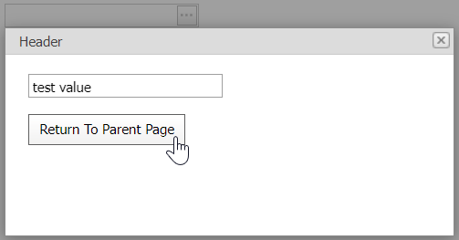

<!-- default badges list -->

[](https://supportcenter.devexpress.com/ticket/details/E347)
[](https://docs.devexpress.com/GeneralInformation/403183)
<!-- default badges end -->
# Popup Control for ASP.NET Web Forms - How to pass a parameter from the content to parent page
<!-- run online -->
**[[Run Online]](https://codecentral.devexpress.com/e347/)**
<!-- run online end -->

This example demonstrates how to use the `ContentUrl` property to specify the pop-up window's content, pass a parameter from the content to parent page, and close the pop-up window.



## Overview

On the parent page, create a popup control and specify its [ContentUrl](https://docs.devexpress.com/AspNet/DevExpress.Web.ASPxPopupControlBase.ContentUrl) property. Add a button edit component to the page and handle its client-side `ButtonClick` event to invoke a pop-up window.

```aspx
<dx:ASPxPopupControl id="ASPxPopupControl1" runat="server" clientinstancename="ASPxPopupControl1"
    ContentUrl="~/ContentUrlPage.aspx">
    <ContentCollection>
        <dx:PopupControlContentControl ID="PopupControlContentControl1" runat="server" />
    </ContentCollection>
</dx:ASPxPopupControl>

<dx:ASPxButtonEdit ID="ASPxButtonEdit1" runat="server" ClientInstanceName="ASPxButtonEdit1">
    <Buttons>
        <dxe:EditButton />
    </Buttons>
    <ClientSideEvents ButtonClick="function(s, e) {
	    ASPxPopupControl1.Show();
    }" />
</dx:ASPxButtonEdit>
```

On the **ContentUrlPage**, create a panel and populate it with a text box editor and a button. On a button click, pass the editor's value as a parameter to the **SelectAndClosePopup** function on the parent page. This function assigns the editor's value to the button edit control and hides the pop-up window.

```aspx
<dx:ASPxPanel ID="ASPxPanel1" runat="server" DefaultButton="ASPxButton1" Width="200px">
    <PanelCollection>
        <dxp:PanelContent runat="server">
            <dx:ASPxTextBox ID="ASPxTextBox1" runat="server" ClientInstanceName="ASPxTextBox1" />
            <br />
            <dx:ASPxButton ID="ASPxButton1" runat="server" AutoPostBack="False"
                Text="Return To Parent Page">
                <ClientSideEvents Click="ReturnToParentPage" />
            </dxe:ASPxButton>
        </dxp:PanelContent>
    </PanelCollection>
</dx:ASPxPanel>
```

```js
function ReturnToParentPage() {
    var parentWindow = window.parent;
    parentWindow.SelectAndClosePopup(ASPxTextBox1.GetValue());
}
```

```js
function SelectAndClosePopup(value){
    ASPxButtonEdit1.SetValue(value);
    ASPxPopupControl1.Hide();
}
```

## Files to Review

* [Default.aspx](./CS/WebSite/Default.aspx) (VB: [Default.aspx](./VB/WebSite/Default.aspx))
* [ContentUrlPage.aspx](./CS/WebSite/ContentUrlPage.aspx) (VB: [ContentUrlPage.aspx](./VB/WebSite/ContentUrlPage.aspx))

## More Examples

* [How to return values from the ASPxPopupControl's ContentUrl page and close the popup on both client and server sides](https://github.com/DevExpress-Examples/how-to-return-values-from-the-aspxpopupcontrols-contenturl-page-and-close-the-popup-on-both-e3098)
* [How to return values from the ASPxPopupControl's ContentCollection and close the popup on both client and server sides](https://github.com/DevExpress-Examples/how-to-return-values-from-the-aspxpopupcontrols-contentcollection-and-close-the-popup-on-bot-e3084)
